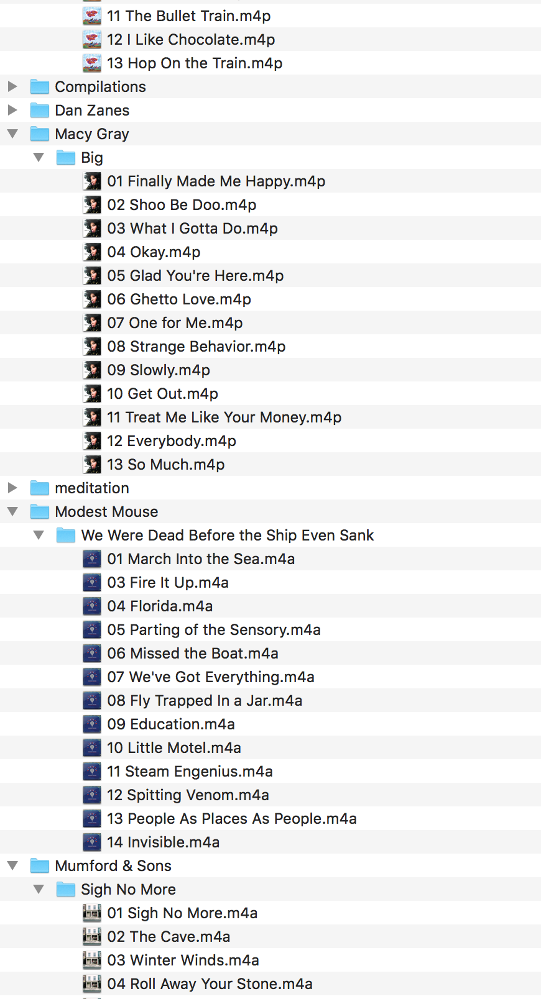
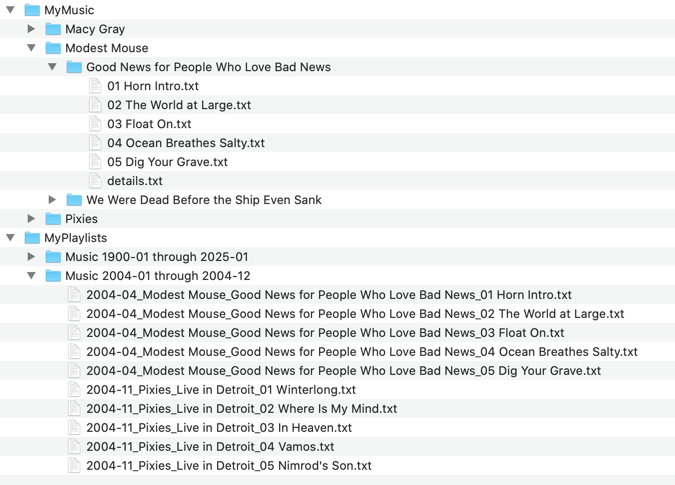

# Music Index

## Objectives

* Implement a hashtable 
* Use a hashtable to index data
* Write a program to load data into the index/hashtable and then to retrieve 
* File manipulation:
  * Traversing directories and files
  * Reading files
  * Copying files
  * Writing files 

# Problem

## Background 

My retired neighbor came to me with this problem: 
Over the past few decades, he's digitized all his music from albums, eight-tracks, 
and cassettes to digital files on his Windows95 computer (okay, maybe not Windows 95, but 
it's an old Windows machine that more or less does what he needs it to. kinda.). 
He wants to play all 
his music in his Chevy Suburban SUV, which is about 15 years old and can play music from 
a USB thumb drive or CDs.  The default software allows him to plug in a USB drive with 
his music and choose an Artist, Album or Track to play. However, he'd really like to 
play all of his music in order of when it was released. There's not a great way to 
easily get that information and create a manual playlist with so many music files. 

It occurred to me that given his existing music library, we could extract information about 
each Artist/Album/Track, look up the release date from a service such as Spotify, 
then write out all the files to a new directory (or maybe multiple directories) 
with new filenames that reflect the ordering he wants to play his music in. Then, 
when that's written out to a USB drive, he can plug it into his car and listen to it 
as he wants. Also, it seemed like a fun little problem for us to take on :) 

## Approach 

There are many, many ways someone could go about this problem, but I will sketch out 
a solution that simplifies the problem in some ways while allowing us to exercise our 
learnings about data structures. 

There are three steps: 
* Read all of the files, recursively, in a directory to capture all Artists, Albums and Tracks there are
  * If needed, lookup the release date (month, year) of the Album
* Put each album into a hashtable to help us index them
* Use the hashtable to read out various subsections of the albums, writing each track out in a new folder in a specified order

### Example Input

A directory, such as `MyMusic`, with the following assumed structure: 



* Each Artist has their own directory
* Each Album has its own directory, under the Artist that created it
* Within each Album directory, there is a separate file for each track on that album
  * For simplicity, in this assignment, they are empty .txt files. 
    * In reality, each track file would be the actual .mp3/audio file.
* Within each Album directory, there is also a `details.txt` file that holds the release date for that album
  * The first line of the file will be something like `YYYY-MM`, where the first 4 characters are the year the album was released, and the 2 chars after the dash is the month
  * All other text in the file (if any) should be ignored

### Example Output



* MyPlaylists
  * Music 1990-01 through 1994-12
    * 1990-01_Artist1_Album1_Track01
    * 1990-01_Artist1_Album1_Track02
    * 1990-01_Artist1_Album1_Track03
    * 1990-01_Artist1_Album1_Track04
    * 1990-02_Artist2_Album1_Track01
    * 1990-02_Artist2_Album1_Track02
    * 1990-02_Artist2_Album1_Track03
    * ...
    * 1994-09_ArtistX_AlbumY_<Track>XX


## Functional Requirements

* Traverse a directory/file system to discover music files 
* Write out all the music files in a way such that each file is in "alphabetical" in the output directory
  * If we were to play every file in alphabetical order in the folder, it would be from "oldest release date" to newest

# The Details

## Build a Hashtable 

We can't do anything without a Hashtable! The file `hashtable.py` has the outline of a Hashtable implementation. 
Fill it in, and use `hashtable_test.py` to help you feel confident about your implementation. 

A few notes: 

* Our hashtable actually stores data in a `KeyValuePair`. This is a helper data class to allow us to store both the key and the data associated with that key.
* You can use Python's provided `hash()` function to calculate a hash on the key.
* You'll see that you've been provided with a Hashtable iterator. This is a helper class that will allow you to do something like:
```python
hashtable = Hashtable()
## put a bunch of things in the hashtable
for index, kvp in enumerate(hashtable): 
    ## Do something with the index or kvp, e.g.: 
    print(f"key: {kvp.key}, value: {kvp.value}")
```

## Build a MusicIndex

We're going to use a class called `MusicIndex` to index our music files.

* A `MusicIndex` extends a `Hashtable`. 
* It stores `Album` data objects (see below) 
* The `Key` is always the release date (`YYYY-MM` format) for an album
* The `Value` is a `list` of `Albums`

## Data Classes

* `Album`
  * `Artist: str`
    * The Artist who produced this album
  * `ReleaseDate: str`
    * format: YYYY-MM
    * The Year/Month of the release of this album
  * `AlbumName: str`
    * The name of this album
  * `Tracks: [<Tracks>]`
    * A list of the tracks on this album
* `Track`: 
  * `Name: str`
    * The name of this track
  * `AbsoluteFilePath: str`
    * The full path of the original .mp3/audio file for this track 

## Creating a "New Playlist"

In this old-school way of handling music files played via very rudimentary software, 
creating a custom playlist means writing the music files of the tracks in your playlist to 
a folder with names that allow the software to play them "alphabetically", thereby playing 
in "Playlist order". It's not quite as complicated as making custom mix-tapes back in the 
cassette days, but I get that anyone who uses Spotify or Apple Music (or other modern music 
software) may find it clunky. 

So, now that we all of our music files indexed, we can use that to write out the music files to 
a specified folder with appropriate names such that when the software is pointed to that directory, 
it plays all the music files in alphabetical order, which happens to be the order we want for our playlist. 

Create a User Interface that: 

* Asks the user for:
  * a start date  
  * an end date
  * an output directory
* Retrieves all the Albums/Tracks that fall within the start and end dates (inclusively)
* In the output directory, create a new folder named like this:
  * "Music <YYYY>-<MM> through <YYYY>-<MM>"
  * If the start date was March 2007 and the end date was December 2010, the directory name will be: 
    * `Music 2007-03 through 2010-12`
* Copies the track files to the new output directory with a new name that looks like this: 
  * <YYYY>-<MM>-<Artist>-<Album>-<TrackId>-<TrackName>.<filetype>
  * So the first track on the "Macy Gray" (Artist) album "Big" that was released in March 2007, called "Finally Made Me Happy" with format ".mp4" will be written out as: 
    * `2007-03-Macy Gray-Big-01-Finally Made Me Happy.mp4`
  * Note that this step requires ACTUALLY copying the source file (as saved in the `Track` data object) to the new directory with a new name.
* There are helper functions to build the music index given the input from the user, but no functions for doing the UI parts. 
